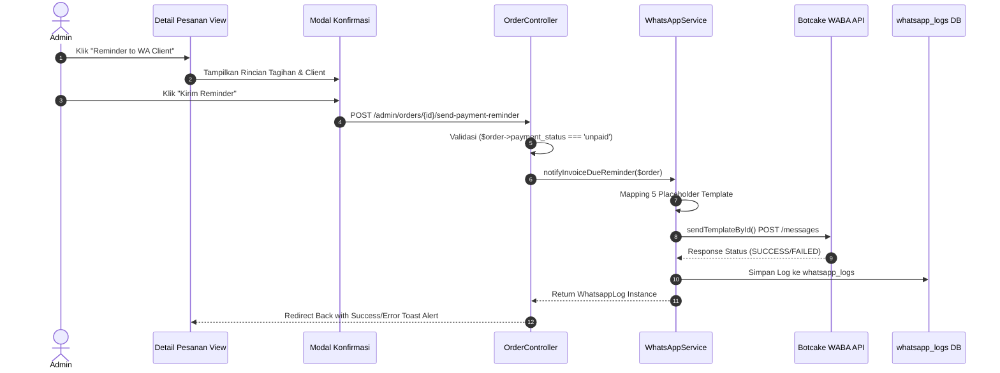

# Dokumentasi Manual Reminder Pembayaran WhatsApp (Invoice Due Reminder)

## 1. Overview
Fitur **Manual Reminder Pembayaran WhatsApp** memungkinkan Admin untuk mengirimkan reminder tagihan/invoice pembayaran secara manual kepada WhatsApp Client langsung dari halaman **Detail Pesanan Admin** (`/admin/orders/{id}`).

Fitur ini memanfaatkan arsitektur Botcake Official WABA API yang sudah ada (`sendTemplateById()`) dengan WhatsApp Template Message yang terverifikasi.

---

## 2. File yang Diubah & Ditambahkan

| File | Status | Keterangan |
|---|---|---|
| `.env` | Modified | Menambahkan env key `BOTCAKE_TEMPLATE_INVOICE_DUE_REMINDER=` |
| `config/services.php` | Modified | Menambahkan mapping template `invoice_due_reminder` |
| `routes/web.php` | Modified | Menambahkan route `POST admin/orders/{order}/send-payment-reminder` |
| `app/Services/WhatsAppService.php` | Modified | Menambahkan method `notifyInvoiceDueReminder(Order $order)` |
| `app/Http/Controllers/Admin/OrderController.php` | Modified | Menambahkan method `sendPaymentReminder(Order $order, WhatsAppService $whatsAppService)` |
| `resources/views/admin/orders/show.blade.php` | Modified | Menambahkan tombol `Reminder to WA Client` & Modal Konfirmasi |
| `docs/invoice-due-reminder.md` | New | Dokumentasi teknis lengkap fitur |

---

## 3. Route yang Ditambahkan

```php
// routes/web.php
Route::post('orders/{order}/send-payment-reminder', [\App\Http\Controllers\Admin\OrderController::class, 'sendPaymentReminder'])
    ->name('orders.send-payment-reminder');
```

---

## 4. Logic Tampil/Sembunyi Tombol (Visibility Rule)

Tombol **`📲 Reminder to WA Client`** diletakkan di samping tombol `Simpan` pada kartu Bukti Pembayaran.

**Aturan Tampil/Sembunyi**:
- **TAMPIL**: Hanya jika `$order->payment_status === 'unpaid'` (Belum Bayar).
- **SEMBUNYI (Otomatis)**: Jika status pembayaran berubah menjadi `pending_verification` (Menunggu Verifikasi), `verified` (Pembayaran Terverifikasi), `rejected` (Pembayaran Ditolak), atau status pesanan `completed`.

```blade
@if($order->payment_status === 'unpaid')
<button type="button" class="btn btn-sm btn-warning text-dark fw-semibold"
    data-bs-toggle="modal" data-bs-target="#paymentReminderModal" title="Kirim Reminder Pembayaran via WhatsApp">
    <i class="fa-brands fa-whatsapp me-1"></i>Reminder to WA Client
</button>
@endif
```

---

## 5. Flow Modal Konfirmasi

1. Admin mengklik tombol `Reminder to WA Client`.
2. Browser menampilkan Modal Konfirmasi **`paymentReminderModal`**.
3. Modal menampilkan rincian data client dan tagihan:
   - **Nama Client**: `$order->user->company_name ?? ($order->form_data['company_name'] ?? $order->user->name)`
   - **Nomor WhatsApp**: `$order->user->phone ?? ($order->form_data['pic_phone'] ?? '-')`
   - **Nomor Invoice**: `$order->order_number`
   - **Nama Layanan**: `$order->service_name ?? ($order->service->name ?? '-')`
   - **Tanggal Jatuh Tempo**: `$order->created_at->addDays(3)->translatedFormat('d F Y')`
   - **Total Tagihan**: `Rp number_format($grandTotal)` (Termasuk PPN)
4. Pilihan Tombol:
   - **Batal**: Menutup modal tanpa aksi.
   - **Kirim Reminder**: Mengirim request `POST` ke route `admin.orders.send-payment-reminder`.

---

## 6. Flow Pengiriman WhatsApp



---

## 7. Mapping Placeholder Template Meta/Botcake

| Placeholder | Variable | Contoh Value |
|---|---|---|
| `{{1}}` | Nama Client | PT Inovasi Solusi Pratama |
| `{{2}}` | Nama Layanan | Paket Virtual Office - Basic |
| `{{3}}` | Nomor Invoice / Order | INV-20260804-001 |
| `{{4}}` | Tanggal Jatuh Tempo | 07 August 2026 |
| `{{5}}` | Total Tagihan | Rp 6.438.000 |

---

## 8. Payload Request Botcake WABA API

Method `sendTemplateById()` secara otomatis membentuk JSON Payload sesuai spesifikasi Meta/Botcake:

```json
{
  "messaging_product": "whatsapp",
  "recipient_type": "individual",
  "to": "6281219110199",
  "type": "template",
  "template": {
    "name": "<TEMPLATE_NAME>",
    "language": {
      "code": "id"
    },
    "components": [
      {
        "type": "body",
        "parameters": [
          { "type": "text", "text": "PT Inovasi Solusi Pratama" },
          { "type": "text", "text": "Paket Virtual Office - Basic" },
          { "type": "text", "text": "INV-20260804-001" },
          { "type": "text", "text": "07 August 2026" },
          { "type": "text", "text": "Rp 6.438.000" }
        ]
      }
    ]
  }
}
```

---

## 9. Cara Testing

### A. Testing Manual dari Dashboard Admin
1. Login sebagai Admin dan buka **Detail Pesanan** yang memiliki `payment_status = 'unpaid'` (Belum Bayar).
2. Amati tombol **`📲 Reminder to WA Client`** berwarna oranye di samping tombol `Simpan`.
3. Klik tombol tersebut, pastikan modal konfirmasi muncul dengan rincian data client yang akurat.
4. Klik **Kirim Reminder**.
5. Verifikasi notifikasi toast alert hijau: *"📲 Reminder pembayaran WhatsApp berhasil dikirim ke client..."*
6. Periksa database tabel `whatsapp_logs` untuk memastikan request & response tercatat dengan lengkap.

### B. Testing Override Nomor Telepon Developer
Seluruh pengiriman WhatsApp pada lingkungan testing dialihkan ke nomor developer yang terkonfigurasi pada `.env`:
`DEV_OVERRIDE_PHONE=081219110199` -> diformat otomatis menjadi `6281219110199`.

---

## 10. Checklist Production Ready

- [x] Tombol **Reminder to WA Client** hanya muncul jika `payment_status === 'unpaid'`.
- [x] Tombol otomatis tersembunyi pada status `pending_verification`, `verified`, `rejected`.
- [x] Controller memvalidasi `payment_status === 'unpaid'` untuk mencegah aksi ilegal/bypass.
- [x] Modal konfirmasi menampilkan data rincian secara lengkap sebelum WhatsApp dikirim.
- [x] Method `notifyInvoiceDueReminder()` menggunakan 5 placeholder standar Botcake WABA API.
- [x] Pengiriman pesan memanfaatkan `sendTemplateById()` tanpa membuat HTTP client/service baru.
- [x] Setiap pengiriman pesan tersimpan secara otomatis di `whatsapp_logs`.
- [x] Env key `BOTCAKE_TEMPLATE_INVOICE_DUE_REMINDER=` telah disiapkan di `.env` dan `config/services.php`.
- [x] Flow bisnis existing (Order, Invoice, Room Benefit) tetap aman 100%.
